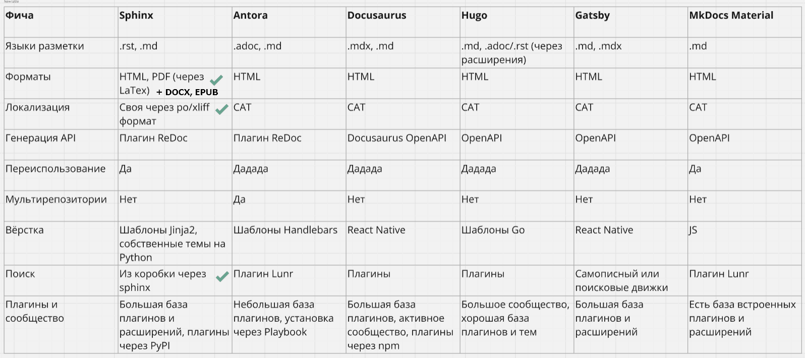

*****************
Карта компетенций
*****************

  Хочу составить план обучения для себя, как тех.писа.
  Очень сильно мечусь и до конца не могу определиться с тем, какую документацию хочу писать. Знаю только,что не ГОСТовскую))
  
  я бы хотела писать больше техническую документацию, изучить подход docs as code, документирование API
  и я уже начинала изучать эти темы, даже курсы проходила,но из-за нехватки практики - толку 0
  и я в ступоре. не знаю как быть и что делать

.. image:: faktorovich.jpg

https://habr.com/ru/companies/documentat/articles/818199/

План действий
=============

1. Составьте карту текущих компетенций. 

Выпишите все ваши навыки и примерно оцените свой уровень владения ими. Подумайте, что из этого вы хотели бы подтянуть.

Выпишите все ваши навыки, определите текущий и желаемый уровни владения (тоже запишите). На этом этапе очень важно трезво оценить свои актуальные возможности и очень конкретно указать цели, которых хотим достичь. Чем подробнее и точнее будут описаны текущий и желаемый уровни, тем лучше будет работать карта.

Примеры:

- Владение языками
- Инструменты документирования
- Различные технологии

2. Дополните карту новыми компетенциями, которыми вы пока не владеете:

а) Проанализируйте вашу текущую профессиональную деятельность и перспективы развития. Может, вам уже не хватает каких-то компетенций, чтобы выполнять свою работу быстрее и качественнее? Или отсутствие каких-то знаний мешает вам продвигаться по карьерной лестнице? Добавьте это в карту компетенций.

б) Откройте какой-нибудь hh и найдите несколько интересных вакансий, которые вам нравятся. Изучите их требования — есть ли там что-то, что вы не умеете и не знаете? Добавьте это в карту компетенций.

в) Расслабьтесь: примите ванну, откиньтесь в уютном кресле или отправьтесь на тихую вечернюю прогулку. Подумайте, что вы бы сами хотели изучить, каким умениям хотели бы научиться? Отбросьте все внешние условия — только ваше собственное желание. Разумеется, добавьте всё это в карту компетенций.

3. Определите, как именно вы будете развивать навыки: найдите подходящие курсы, обучающие материалы, книги, менторство, посещение конференций и митапов.
4. Определите приоритеты и сроки для каждого навыка:
   
   A. Сначала определите круг навыков, которыми вы вообще будете заниматься.
   B. Ввыделите из них срочные (ближайшие 3 месяца), среднесрочные (ближайшие полгода), голубые мечты (ближайший год).

Шаблон карты
============

https://docs.google.com/spreadsheets/d/1rdyqiLabGgv2NnBiczOotiDlfsUrFAYzV_MB9NiRP3Y/edit?usp=sharing

Полезные ссылки
===============

- https://alexjameson.github.io/articles/soft-and-hard-skills/
- https://vkvideo.ru/video-209665992_456239242
- https://techwriterdays.ru/ru/talk/117169

************
Docs-as-code
************

Мой опыт изучения
=================

Все изучить невозможно.

1. Выбрал генератор и язык разметки.
2. Придумал список задач, что хочу сделать с помощью инструмента.
3. Задокументировал свои действия в самом инструменте.
4. Выложил результат на GitHub Pages:

   - https://fish-train.github.io/flnt-test/
   - https://sph-learning.readthedocs.io/ru/latest/index.html
   - https://fish-train.github.io/DevOps_Docs/

С чего начать
=============

Определитесь с требованиями к вашей документации или учебному проекту:

- Выходной формат: HTML, DOCX, PDF или другие
- Если нужен HTML, то какие фичи должны быть в статическом сайте
- Требования к оформлению
- Перевод на другие языки
- Интеграция с Confluence
- Переиспользование контента
- Будет ли описание API?

Выбор инструмента
=================

Был доклад на TWD от Анжелы Андроновой: https://techwriterdays.ru/ru/talk/119442

Таблица из доклада Анжелы Андроновой (Rustore) на TechWriter Days #1:

Свежее сравнение от Александра Яковлева (Яндекс): https://alexjameson.github.io/ssg-comparison/

Общая информация:

- https://t.me/docsascode
- https://www.youtube.com/watch?v=1CuMeMYwtbg
- https://www.youtube.com/watch?v=8Aydox51bfo
- https://www.youtube.com/watch?v=6CKVodl2YcA
- https://www.youtube.com/watch?v=1CuMeMYwtbg
- https://youtu.be/ok9KMRCbrq8
- https://youtu.be/xqev76iddio
- https://jamstackthemes.dev/
- https://jamstack.org/generators/
- https://starkovden.github.io/Doc-as-code-tools.html
- https://habr.com/ru/companies/plesk/articles/555110/
- https://starkovden.github.io/Static-site-generators.html

Язык разметки
-------------

Markdown
^^^^^^^^

Самый простой язык, но без спецификации, и с большим количеством диалектов:

- https://daringfireball.net/projects/markdown/syntax
- https://github.com/adam-p/markdown-here/wiki/Markdown-Cheatsheet

ReStructuredText
^^^^^^^^^^^^^^^^

Язык разметки с единой спецификацией. 

- https://docutils.sourceforge.io/rst.html
- https://www.sphinx-doc.org/en/master/usage/restructuredtext/index.html
- https://www.writethedocs.org/guide/writing/reStructuredText/

AsciiDoc
^^^^^^^^

Язык разметки, специально разработанный для документирования: https://asciidoc.org/

- https://t.me/asciidoctor
- `Antora <https://antora.org/>`_
- `AsciiDoc & doc-as-code Best Practices <https://bcouetil.gitlab.io/academy/BP-asciidoc.html>`_
- https://habr.com/ru/articles/550086/
- https://newpodcast2.live/podcast/vanya-and-asiidoc/
- https://habr.com/ru/users/fiddle-de-dee/publications/articles/

Генераторы документации
-----------------------

- MkDocs, Docusaurus используют markdown
- Sphinx на reStructuredText и markdown
- Antora и Asciidoctor - у них asciidoc

MkDocs
^^^^^^

Еще один генератор на md: https://www.mkdocs.org/

Тема Material: https://squidfunk.github.io/mkdocs-material/

Был доклад на TWD от Никиты Груздева: https://techwriterdays.ru/ru/talk/117387

Hugo
^^^^

Пожалуй, самый быстрый генератор: https://gohugo.io/

Был доклад на TWD от Марселя Ардуанова: https://techwriterdays.ru/ru/talk/118317

Docusaurus
^^^^^^^^^^

Генератор доки на npm и react.js: https://docusaurus.io/

Gramax
^^^^^^

WYSIWYG-редактор с Git под катом и сборкой в HTML:

- https://gram.ax/
- https://t.me/gramax_chat

Был доклад на TWD: Александ Мачулин + Екатерина Павлова + Станислав Петров - https://techwriterdays.ru/ru/talk/120049 и https://techwriterdays.ru/ru/talk/118802

Diplodoc
^^^^^^^^

Использует Yandex Cloud:

- https://diplodoc.com/
- https://t.me/diplodoc_ru
- https://www.youtube.com/watch?v=ZYbM7duELYA

Sphinx
^^^^^^

- https://www.sphinx-doc.org/en/master/
- https://www.youtube.com/watch?v=vFAkt_N6yuk&list=PLPDCBPbzk1AYghqYazE7Cxt3p7edml8I7
- https://www.youtube.com/watch?v=8Aydox51bfo&t=5s
- https://sublime-and-sphinx-guide.readthedocs.io/en/latest/index.html
- https://docs.readthedocs.io/en/stable/intro/getting-started-with-sphinx.html
- https://sphinx-ru.readthedocs.io/archive.html

Преимущества:

- `возможность перевода текстов из коробки <https://www.writethedocs.org/guide/writing/reStructuredText/>`_
- популярность
- `поддержка Markdown <https://myst-parser.readthedocs.io/en/latest/intro.html>`_
- выгрузка в различные форматы

Был мой доклад на TWD: https://techwriterdays.ru/ru/talk/117392

Опыт других компаний
====================

- https://habr.com/ru/articles/824866/
- https://habr.com/ru/companies/vk/articles/826904/
- https://habr.com/ru/companies/moysklad/articles/854708/
- https://habr.com/ru/companies/cloud_ru/articles/686050/
- https://habr.com/ru/companies/cloud_ru/articles/767014/

Еще-как-Код
===========

Презентации
-----------

Фреймворк Reveal.js для создания презентаций: https://revealjs.com/

Диаграммы и схемы
-----------------

- Mermaid: https://mermaid.js.org/
- Graphviz: https://graphviz.org/
- PlantUML: https://plantuml.com/ru/

***
API
***

Типов API очень много. Важно понимать, что REST API - это популярный тип, но далеко не единственный.

- https://aws.amazon.com/ru/what-is/api/
- https://doka.guide/tools/api/
- https://practicum.yandex.ru/blog/chto-takoe-api/
- https://education.yandex.ru/journal/chto-takoe-api

Полезные ссылки:

- `Курс по документированию REST API <https://starkovden.github.io/about-first-module.html>`_ и https://idratherbewriting.com/learnapidoc/
- https://events.yandex.ru/events/hyperbaton/msk-may-2014?openTalkVideo=440-3
- `О проектировании API <https://twirl.github.io/The-API-Book/API.ru.html>`_
- `Postman Tutorial <https://www.youtube.com/watch?v=juldrxDrSH0&list=PLhW3qG5bs-L-oT0GenwPLcJAPD_SiFK3C>`_
- https://stepik.org/course/124947/promo?search=3135701936

OpenAPI и Swagger
=================

OpenAPI – спецификация для описания REST API. Правила, по которым можно описать API к продукту в JSON- или YAML-форматах. Есть несколько версий. Они отличаются структурой и некоторыми тегами.

Ссылки:

- https://github.com/OAI/OpenAPI-Specification
- https://spec.openapis.org/oas/latest.html
- https://swagger.io/specification/

Swagger – набор инструментов для описания и визуализации API:

- `Swagger Codegen <https://swagger.io/tools/swagger-codegen/>`_. Генерирует код SDK клиента для множества различных языков. Software development kit - комплект для разработки программного обеспечения, помогает разработчикам реализовать API.
- `Swagger Editor <https://swagger.io/tools/swagger-editor/>`_. Онлайн-редактор, который проверяет документацию OpenAPI на соответствие правилам спецификации OpenAPI. Редактор Swagger помечает ошибки и дает советы по форматированию. Swagger Editor
- `Swagger UI <http://petstore.swagger.io/>`_. Веб-фрэймворк с открытым кодом, который парсит спецификацию OpenAPI и генерирует интерактивную страницу сайта с документацией.
- `SwaggerHub <https://swagger.io/tools/swaggerhub/>`_. Сайт, разработанный Smartbear, с целью помочь командам совместно работать над спецификацией OpenAPI. Помимо создания интерактивной документации из SwaggerHub, можно создавать множество клиентских и серверных SDK и других сервисов.

Подробнее:

- `Documenting APIs: A guide for technical writers and engineers <https://idratherbewriting.com/learnapidoc/openapi_tutorial.html>`_
- https://blog.skillfactory.ru/glossary/swagger/
- `Интеграция Swagger с документацией <https://fish-train.github.io/flnt-test/swagger/>`_ 
- `Интеграция Swagger с документацией <https://starkovden.github.io/integrating-swagger-with-docs>`_

Инструменты для документирования REST API на основе OpenAPI спецификации:

- ReDoc: https://redocly.com/
- Slate: https://github.com/slatedocs/slate
  
Польза от изучения
==================

- попробовать на себе задачи разработчика
- стать ближе к разработчикам, говорить с ними на одном языке
- понимать, что нужно разработчикам в документации API

******
Облака
******

Попробовать развернуть какое-нибудь приложение на бесплатном тарифе: https://cloud.ru/ru/free-tier. Документация: https://cloud.ru/ru/docs/evolution/overview/topics/free-tier.html

- https://cloud.ru/ru/education/bystryj-start-advanced
- https://practicum.yandex.ru/ycloud/

***
Git
***

Сфокусируйтесь на базовых командах и операциях: add, commit, push, pull, rebase, разрешение конфликтов.

- https://git-scm.com/book/ru/v2
- https://htmlacademy.ru/blog/git/git-console
- https://githowto.com/ru
- https://learngitbranching.js.org/?locale=ru_RU
