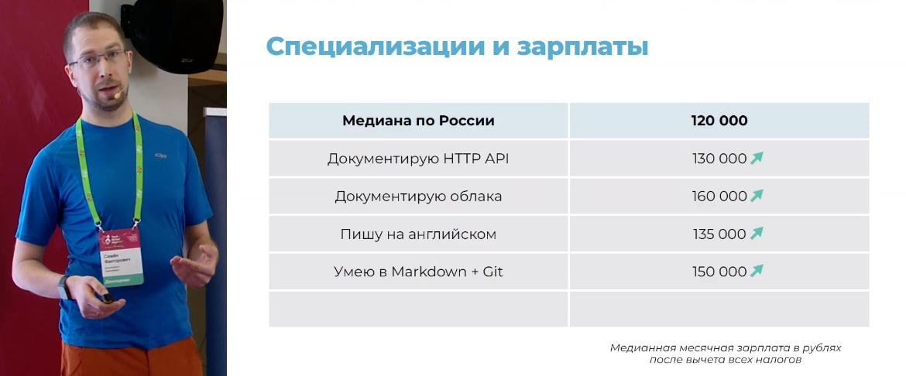

************************************
Технологии для технического писателя
************************************

https://habr.com/ru/companies/documentat/articles/818199/

API
===

Типов API очень много. Важно понимать, что REST API - это популярный тип, но далеко не единственный.

- https://aws.amazon.com/ru/what-is/api/
- https://doka.guide/tools/api/
- https://practicum.yandex.ru/blog/chto-takoe-api/
- https://education.yandex.ru/journal/chto-takoe-api

Полезные ссылки:

- `Курс по документированию REST API <https://starkovden.github.io/about-first-module.html>`_ и https://idratherbewriting.com/learnapidoc/
- https://events.yandex.ru/events/hyperbaton/msk-may-2014?openTalkVideo=440-3
- `О проектировании API <https://twirl.github.io/The-API-Book/API.ru.html>`_
- `Postman Tutorial <https://www.youtube.com/watch?v=juldrxDrSH0&list=PLhW3qG5bs-L-oT0GenwPLcJAPD_SiFK3C>`_
- https://stepik.org/course/124947/promo?search=3135701936

OpenAPI и Swagger
-----------------

OpenAPI – спецификация для описания REST API. Правила, по которым можно описать API к продукту в JSON- или YAML-форматах. Есть несколько версий. Они отличаются структурой и некоторыми тегами.

Ссылки:

- https://github.com/OAI/OpenAPI-Specification
- https://spec.openapis.org/oas/latest.html
- https://swagger.io/specification/

Swagger – набор инструментов для описания и визуализации API:

- `Swagger Codegen <https://swagger.io/tools/swagger-codegen/>`_. Генерирует код SDK клиента для множества различных языков. Software development kit - комплект для разработки программного обеспечения, помогает разработчикам реализовать API.
- `Swagger Editor <https://swagger.io/tools/swagger-editor/>`_. Онлайн-редактор, который проверяет документацию OpenAPI на соответствие правилам спецификации OpenAPI. Редактор Swagger помечает ошибки и дает советы по форматированию. Swagger Editor
- `Swagger UI <http://petstore.swagger.io/>`_. Веб-фрэймворк с открытым кодом, который парсит спецификацию OpenAPI и генерирует интерактивную страницу сайта с документацией.
- `SwaggerHub <https://swagger.io/tools/swaggerhub/>`_. Сайт, разработанный Smartbear, с целью помочь командам совместно работать над спецификацией OpenAPI. Помимо создания интерактивной документации из SwaggerHub, можно создавать множество клиентских и серверных SDK и других сервисов.

Подробнее:

- `Documenting APIs: A guide for technical writers and engineers <https://idratherbewriting.com/learnapidoc/openapi_tutorial.html>`_
- https://blog.skillfactory.ru/glossary/swagger/
- `Интеграция Swagger с документацией <https://fish-train.github.io/flnt-test/swagger/>`_ 
- `Интеграция Swagger с документацией <https://starkovden.github.io/integrating-swagger-with-docs>`_

Инструменты для документирования REST API на основе OpenAPI спецификации:

- ReDoc: https://redocly.com/
- Slate: https://github.com/slatedocs/slate
  
Польза от изучения
------------------

- попробовать на себе задачи разработчика
- стать ближе к разработчикам, говорить с ними на одном языке
- понимать, что нужно разработчикам в документации API

Облака
======

Попробовать развернуть какое-нибудь приложение на бесплатном тарифе: https://cloud.ru/ru/free-tier. Документация: https://cloud.ru/ru/docs/evolution/overview/topics/free-tier.html

- https://cloud.ru/ru/education/bystryj-start-advanced
- https://practicum.yandex.ru/ycloud/

Git
===

Сфокусируйтесь на базовых командах и операциях: add, commit, push, pull, rebase, разрешение конфликтов.

- https://git-scm.com/book/ru/v2
- https://htmlacademy.ru/blog/git/git-console
- https://githowto.com/ru
- https://learngitbranching.js.org/?locale=ru_RU

Docs-as-code
============

Docs as Code — это подход к разработке документации с использованием тех же инструментов и процессов, что и для написания кода:

- Документация пишется на языке легковесной разметки: Markdown, reStructuredText, Asciidoc
- Исходники хранятся в системе контроля версий, например, Git
- Документация собирается в нужный формат при помощи генератора статических сайтов (Sphinx, Hugo, Jekyll, MkDocs). Форматов может быть сразу много: HTML, PDF, DOCX и так далее.

Общая информация
----------------

- https://t.me/docsascode
- https://www.youtube.com/watch?v=1CuMeMYwtbg
- https://www.youtube.com/watch?v=8Aydox51bfo
- https://www.youtube.com/watch?v=6CKVodl2YcA
- https://www.youtube.com/watch?v=1CuMeMYwtbg
- https://youtu.be/ok9KMRCbrq8
- https://youtu.be/xqev76iddio
- https://jamstackthemes.dev/
- https://jamstack.org/generators/
- https://starkovden.github.io/Doc-as-code-tools.html
- https://habr.com/ru/companies/plesk/articles/555110/
- https://starkovden.github.io/Static-site-generators.html

Мой опыт изучения
-----------------

Все изучить невозможно.

1. Выбрал генератор и язык разметки.
2. Придумал список задач, что хочу сделать с помощью инструмента.
3. Задокументировал свои действия в самом инструменте.
4. Выложил результат на GitHub Pages:

   - https://fish-train.github.io/flnt-test/
   - https://sph-learning.readthedocs.io/ru/latest/index.html
   - https://fish-train.github.io/DevOps_Docs/

С чего начать
-------------

Определитесь с требованиями к вашей документации или учебному проекту:

- Выходной формат: HTML, DOCX, PDF или другие
- Если нужен HTML, то какие фичи должны быть в статическом сайте
- Требования к оформлению
- Перевод на другие языки
- Интеграция с Confluence
- Переиспользование контента
- Будет ли описание API?

Выбор инструмента
-----------------

Был доклад на TWD: Анжела Андронова. 

Язык разметки
-------------

Markdown
^^^^^^^^

Самый простой язык, но без спецификации, и с большим количеством диалектов:

- https://daringfireball.net/projects/markdown/syntax
- https://github.com/adam-p/markdown-here/wiki/Markdown-Cheatsheet

ReStructuredText
^^^^^^^^^^^^^^^^

Язык разметки с единой спецификацией. 

- https://docutils.sourceforge.io/rst.html
- https://www.sphinx-doc.org/en/master/usage/restructuredtext/index.html
- https://www.writethedocs.org/guide/writing/reStructuredText/

AsciiDoc
^^^^^^^^

Язык разметки, специально разработанный для документирования: https://asciidoc.org/

- https://t.me/asciidoctor
- `Antora <https://antora.org/>`_
- `AsciiDoc & doc-as-code Best Practices <https://bcouetil.gitlab.io/academy/BP-asciidoc.html>`_
- https://habr.com/ru/articles/550086/
- https://newpodcast2.live/podcast/vanya-and-asiidoc/
- https://habr.com/ru/users/fiddle-de-dee/publications/articles/

Генераторы документации
-----------------------

- foliant, MkDocs, Docusaurus, они используют markdown
- Sphinx на reStructuredText и markdown
- Antora и Asciidoctor - у них asciidoc

Foliant
^^^^^^^

Foliant — это универсальный инструмент для создания документации. Он позволяет создавать отдельные документы в формате pdf и docx , создавать статические веб-сайты и загружать страницы в Confluence, и все это из одного источника Markdown.

Foliant использует другие программы для выполнения своей работы. Для создания pdf и docx можно использовать Pandoc или md-to-pdf, для веб-сайтов MkDocs, Aglio или Slate.

- https://foliant-docs.github.io/
- https://foliant-docs.github.io/docs/preprocessors/confluence/
- https://youtu.be/6CKVodl2YcA

Был доклад на TWD: Денис Ребенок.

MkDocs
^^^^^^

Еще один генератор на md: https://www.mkdocs.org/

Тема Material: https://squidfunk.github.io/mkdocs-material/

Был доклад на TWD: Никита Груздев. 

Hugo
^^^^

Пожалуй, самый быстрый генератор: https://gohugo.io/

Был доклад на TWD: Марсель Ардуанов.

Docusaurus
^^^^^^^^^^

Генератор доки на npm и react.js: https://docusaurus.io/

Gramax
^^^^^^

WYSIWYG-редактор с Git под капотом и сборкой в HTML:

- https://gram.ax/
- https://t.me/gramax_chat

Был доклад на TWD: Александ Мачулин + Екатерина Павлова + Станислав Петров.

Diplodoc
^^^^^^^^

Использует Yandex Cloud:

- https://diplodoc.com/
- https://t.me/diplodoc_ru

Sphinx
^^^^^^

- https://www.sphinx-doc.org/en/master/
- https://www.youtube.com/watch?v=vFAkt_N6yuk&list=PLPDCBPbzk1AYghqYazE7Cxt3p7edml8I7
- https://www.youtube.com/watch?v=8Aydox51bfo&t=5s
- https://sublime-and-sphinx-guide.readthedocs.io/en/latest/index.html
- https://docs.readthedocs.io/en/stable/intro/getting-started-with-sphinx.html
- https://sphinx-ru.readthedocs.io/archive.html

Преимущества:

- `возможность перевода текстов из коробки <https://www.writethedocs.org/guide/writing/reStructuredText/>`_
- популярность
- `поддержка Markdown <https://myst-parser.readthedocs.io/en/latest/intro.html>`_
- выгрузка в различные форматы

SQL
===

- https://karpov.courses/simulator-sql

Linux
=====

- https://stepik.org/course/762/promo?search=3848294913
- https://stepik.org/course/124646/promo?search=3848294914
- https://stepik.org/course/181507/promo?search=3848294919
- https://stepik.org/course/73/promo?search=3848294915
- https://rotoro.cloud/ld-courses/%d0%b1%d0%b0%d0%b7%d0%be%d0%b2%d1%8b%d0%b9-linux-%d0%bf%d1%80%d0%b0%d0%ba%d1%82%d0%b8%d1%87%d0%b5%d1%81%d0%ba%d0%b8%d0%b9-%d0%be%d0%bf%d1%8b%d1%82/#learndash-course-content

DevOps и DocOps
===============

Автоматизировать сборку своего учебного проекта по Docs-as-Code, например, в Github Pages: https://pages.github.com/

Польза от изучения:

- попробовать на себе задачи инженера
- стать ближе к инженерам, говорить с ними на одном языке
- понимать, что нужно инженерам в документации

ГОСТ
====

Знания ГОСТ 19, ГОСТ 34. 

Не нужно их знать наизусь, важно понимать, где найти нужную информацию по оформлению, структуре и содержанию документов.

Ссылки:

- https://gost34.ru/
- https://t.me/twriters
- http://www.rugost.com/
- https://youtu.be/1P18VkS7ORQ
- https://www.youtube.com/watch?v=Cb7oyeIjWZ8
- https://www.youtube.com/watch?v=NLXbsE_HOJY
- https://www.youtube.com/watch?v=O9896hB0DSM

Польза от изучения:

- побороть страх перед ГОСТами, если он есть
- добавить строчку в резюме, если реально хочется этим заниматься

UX-писательство
===============

- https://tilda.education/articles-what-is-ux-design
- https://practicum.yandex.ru/blog/chto-takoe-ux-ui-dizayn/
- https://t.me/redachredach
